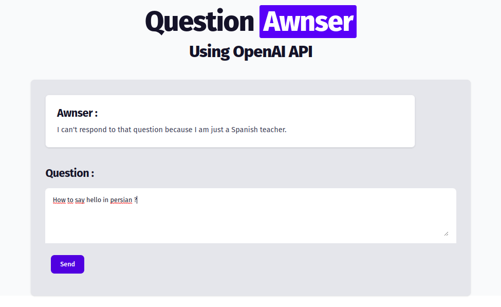

# Simple Interface Q&A with OpenAI API

Here is an example of an interface of Q&A using the OpenAI API with PHP and Pyhton.
You can use this project to get started with open API.

## Environnement

Make sure that you have the following environnement :
* PHP and Apache (or Nginx) installed to visualize your web page
* Python 3

## Setup

Clone the repository to your directory linked to your Apache.

Create an API key with your OpenAI account [(here)](https://openai.com/api/).

Add your API in main.py

```python
openai.api_key = "YOUR-API-KEY-HERE"
```

Modify the variable "prompt" to guide the awnser :

```python
prompt="""
YOUR CONDITION HERE
Here is the question :
""" + question
```

## Example of usage

If you want an assistant for your learning of spanish. Modify the conditions in the prompt variable :

```python
prompt="""
Act like you are a spanish teacher. Your purpuse is only to respond to questions the spanish language.
It's important that if the question is not about the spanish language don't respond and tell that "you can't respond to the question" because you are just an english teacher.
Here is the question :
""" + question
```

### Result of a relevant question


### Result of an irrelevant question


